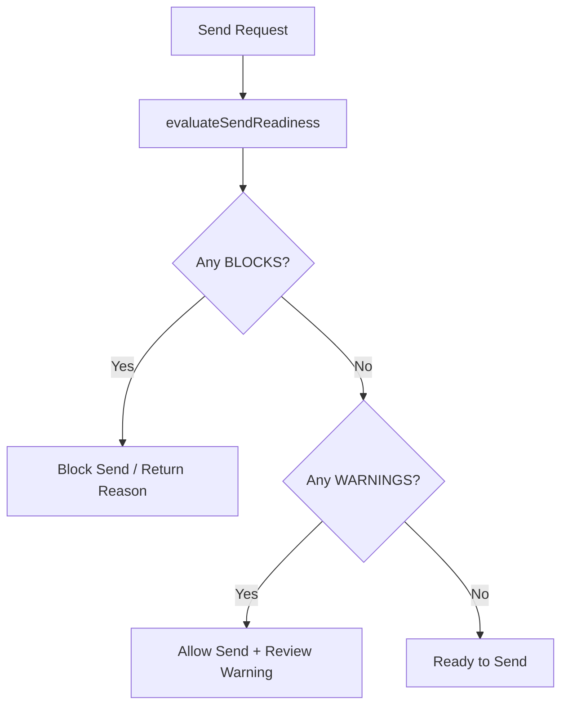

# Security & Deliverability Safety Policy

This document details the security and deliverability safeguards built into the Proactive Outreach Agent to enforce tenant isolation, protect sender reputations, and prevent accidental spamming.

## 🏢 Tenant Scoping & Workspace Isolation

To prevent cross-tenant data leaks or unauthorized operations, the codebase enforces a strict workspace scoping policy:

1. **Workspace Context Resolution**:
   - Every API request must resolve the tenant's context by calling `requireWorkspace()` or `requireRole()`.
   - This returns the validated `organizationId` and `userId` from the session.

2. **Scoped Reads & Writes**:
   - Database lookups (e.g., `findFirst`, `findMany`) on tenant-owned resources (messages, signals, leads, sending domains, sender accounts, jobs) must explicitly include `organizationId: context.organizationId` in their criteria.
   - Any query attempting to read or write a record by ID alone without tenant validation is strictly prohibited.
   - Database writes (e.g., creating a `Signal` or a `Lead`) must explicitly assign the resolved `organizationId` from the context.

3. **Database Constraints & Indexes**:
   - The database schema includes composite unique constraints (e.g., `@@unique([organizationId, email])` on `Lead`, and `@@unique([organizationId, domain])` on `SendingDomain`) to maintain data integrity across tenants.

---

## 🚦 Shared Send-Readiness Evaluator

All outbound outreach messages must pass through a single, shared source of truth evaluator: **`src/lib/deliverability/send-readiness.ts`**.
Routes, services, and background workers are forbidden from implementing parallel safety check logic.

### Checks Performed
- **Approval Gate**: Verifies the message is in `approved` status.
- **Safety Lists**: Verifies that the lead is not blacklisted, not marked do-not-contact, and that their email is not on the workspace's do-not-contact list.
- **Email Validation**: Formally validates the recipient email format.
- **Campaign State**: Validates that the attached campaign is active and has not reached its daily limit.
- **Sender Health**: Validates that the sender account is active, has not exceeded its daily sending quota, and maintains a healthy reputation score.
- **Domain Verification**: Validates that the sending domain is verified (SPF, DKIM, DMARC), has not exceeded daily limits, is compliant with the 30-day warmup schedule, and is not temporarily paused due to reputation drops.
- **Queue/Redis Health**: Evaluates if Redis is online and queue health indicators (dead or stale jobs) are within acceptable limits.

### Action Outcomes
- **`pass`** (“Ready”): Message is safe to send.
- **`warn`** (“Can queue, but review first”): Message can be enqueued, but some configuration requires attention (e.g., Redis offline, minor job queue lag).
- **`block`** (“Cannot send”): Message is unsafe to send and will be blocked with a structured reason (e.g., blacklisted lead, unverified domain, reputation drop).

---

## 🔗 Webhook & Delivery Safeguards

1. **Webhook Signature Verification**:
   - All incoming webhook endpoints (e.g., `/api/webhooks/resend`) verify payloads using the configured `RESEND_WEBHOOK_SECRET`.
   - Payloads without valid signatures are rejected immediately.

2. **Automated Deliverability Responses**:
   - **Hard Bounces**: When a `bounced` event is received, the lead is immediately marked as blacklisted and the email is added to the workspace `DoNotContact` table.
   - **Complaints**: If a recipient marks an email as spam, the address is immediately blacklisted to protect domain reputation.
   - **Unsubscribes**: Unsubscribe events immediately transition the lead status to `unsubscribed`.
