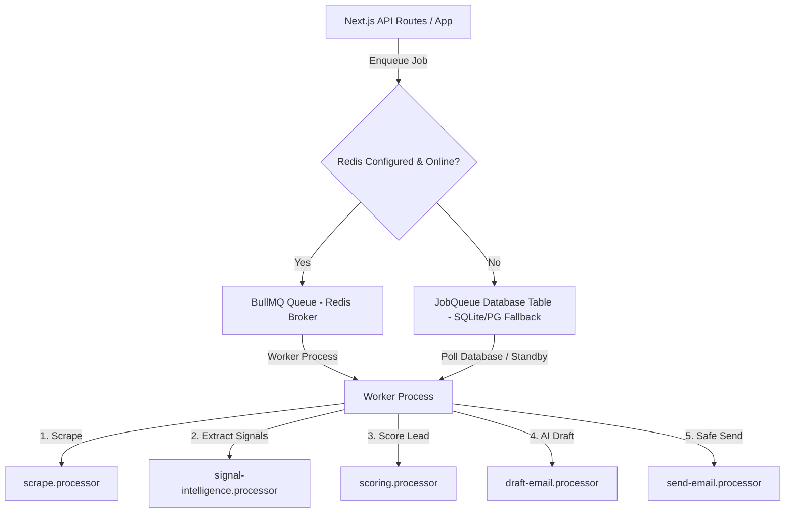

# Worker Processing & Job Queue Architecture

The Proactive Outreach Agent uses a background worker system to manage asynchronous, resource-heavy operations like web scraping, signal extraction, scoring, draft generation, email sending, and reply classification.

## Worker Architecture



### 1. Redis Mode (BullMQ)
When `REDIS_URL` is configured and the Redis broker is reachable, the application leverages **BullMQ** for real-time queue orchestration.
- **Commands**:
  - Dev mode with hot reload: `npm run dev:worker`
  - Production mode: `npm run worker` (runs `tsx scripts/worker.ts`)

### 2. Database Fallback Mode (`queued_without_redis`)
If Redis is not configured or goes offline:
- The system automatically captures and saves job payloads to the `JobQueue` table in the database.
- A `queued_without_redis: true` status flag is returned in API responses.
- This ensures the application remains online and robust, allowing users to queue outreach emails even during cache failures.
- Jobs are subsequently processed using an inline or polling worker execution loop.

---

## Job Queues

The background worker manages the following job queues:

1. **`scrape`**: Performs web scraping on company homepages, about pages, and careers sections.
2. **`signal-intelligence`**: Invokes LLM signal extractors to parse scraped copy and score signals for urgency.
3. **`scoring`**: Re-computes composite lead scores, signal strengths, and spam risks.
4. **`draft-email`**: Generates draft message copy utilizing top signals and personalizer heuristics.
5. **`send-email`**: Runs pre-send checks and delivers outreach emails via Resend.
6. **`webhook-processing`**: Processes incoming email delivery tracking payloads asynchronously to avoid API timeout constraints.

---

## 🔍 Distributed Tracing

Every job run contains a unique `traceId` which is propagated through the entire lifecycle:
`API route (Trace ID created) → Enqueued Job → Worker Log → Resend Send Action → Webhook Processing`

- In the UI, trace IDs are exposed in the **Job Health** panel and the **Approval Queue debug logs** to allow easy tracking of job errors.
- Logging output automatically includes the corresponding `traceId` for rapid log correlation:
  ```
  [2026-06-16T18:35:00] [EmailSender] [INFO] [trace_82f1b90d] Processing message msg_9a8c7b3
  ```
