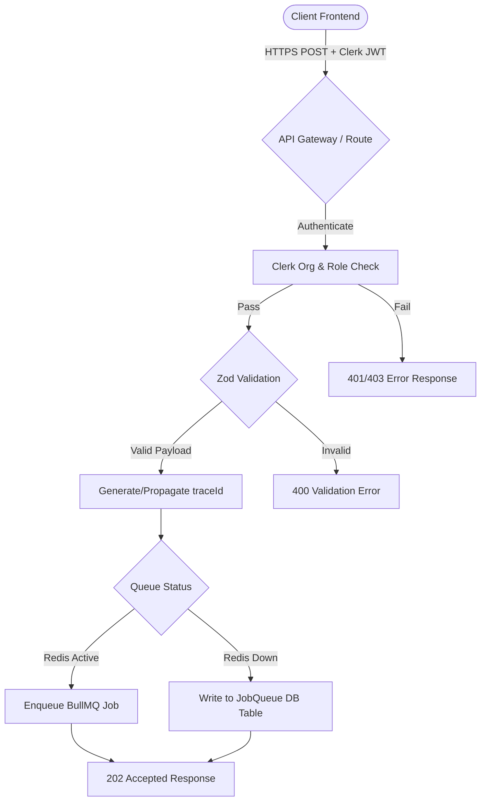

# API Design & Contracts — Proactive Outreach Agent

This document specifies all REST API endpoints, payload schemas, authorization roles, traceId standards, and webhook integration rules for the Proactive Outreach Agent.

---

## 1. Request Orchestration Lifecycle

The API layer acts as a gateway that validates payloads, checks identity, and routes execution to background workers.



---

## 2. Global Protocol Standard

### Standard Response Envelope
All API endpoints return a unified response shape:

```json
{
  "success": true,
  "data": {},
  "traceId": "tr_628df8f9a2d3e5b1"
}
```

In the event of an error:

```json
{
  "success": false,
  "error": {
    "code": "validation_error",
    "message": "Invalid request payload"
  },
  "traceId": "tr_628df8f9a2d3e5b1"
}
```

### Trace ID Propagation
Every client request can pass an optional `traceId` in the root request JSON. If absent, the gateway generates a unique string using `createTraceId()`. This ID is returned in the response header `X-Trace-Id` and response envelope, and is mapped to all DB logs and background jobs to facilitate end-to-end tracing.

---

## 3. Pipeline Orchestration Endpoint (`POST /api/orchestrate`)

This endpoint processes actions related to the pipeline.

- **URL**: `/api/orchestrate`
- **Method**: `POST`
- **Default Auth**: Clerk JWT. Tenant isolation is enforced via the active `organizationId` from Clerk context.

### Actions Specification

#### 1. `add_lead`
- **Role Requirement**: `member`
- **Zod Schema**:
  ```json
  {
    "action": "add_lead",
    "name": "string (min 1)",
    "email": "string (email)",
    "company": "string (optional)",
    "title": "string (optional)",
    "url": "string (optional)",
    "linkedinUrl": "string (optional)",
    "autonomyEnabled": "boolean (optional)"
  }
  ```
- **Success Response**: `200 OK` with data: `{ created: boolean, lead: Lead }`

#### 2. `add_sample_data`
- **Role Requirement**: `member`
- **Zod Schema**:
  ```json
  {
    "action": "add_sample_data"
  }
  ```
- **Success Response**: `200 OK` with data: `{ success: true, count: number }`

#### 3. `import_csv`
- **Role Requirement**: `member`
- **Zod Schema**:
  ```json
  {
    "action": "import_csv",
    "csvText": "string (min 1)",
    "source": "string (optional)"
  }
  ```
- **Success Response**: `200 OK` with data: `{ created: number, updated: number, skipped: number, leads: Lead[] }`

#### 4. `run_observe` / `run_signal_intelligence`
- **Role Requirement**: `member`
- **Zod Schema**:
  ```json
  {
    "action": "run_observe" | "run_signal_intelligence",
    "leadId": "string (min 1)",
    "urls": "string[] (optional)"
  }
  ```
- **Success Response**: `202 Accepted` with data: `{ success: true, jobEnqueued: boolean }`

#### 5. `run_think` / `generate_email`
- **Role Requirement**: `member`
- **Zod Schema**:
  ```json
  {
    "action": "run_think" | "generate_email",
    "leadId": "string (min 1)",
    "campaignId": "string (optional)",
    "objective": "string (optional)"
  }
  ```
- **Success Response**: `202 Accepted` with data: `{ success: true, messageId: string }`

#### 6. `run_pipeline` / `run_full_pipeline`
- **Role Requirement**: `member`
- **Zod Schema**:
  ```json
  {
    "action": "run_pipeline" | "run_full_pipeline",
    "leadId": "string (min 1)",
    "campaignId": "string (optional)"
  }
  ```
- **Success Response**: `202 Accepted` with data: `{ runId: string }`

#### 7. `batch_generate`
- **Role Requirement**: `member`
- **Zod Schema**:
  ```json
  {
    "action": "batch_generate",
    "leadIds": "string[] (min 1)",
    "campaignId": "string (optional)"
  }
  ```
- **Success Response**: `202 Accepted` with data: `{ batchId: string, count: number }`

#### 8. `approve_message`
- **Role Requirement**: `member`
- **Zod Schema**:
  ```json
  {
    "action": "approve_message",
    "messageId": "string (min 1)",
    "editedBody": "string (optional)"
  }
  ```
- **Success Response**: `200 OK` with data: `{ approved: true, messageId: string }`

#### 9. `send_message`
- **Role Requirement**: `member`
- **Zod Schema**:
  ```json
  {
    "action": "send_message",
    "messageId": "string (min 1)"
  }
  ```
- **Success Response**: `202 Accepted` with data: `{ success: true, status: "queued" }`

#### 10. `classify_reply` / `run_reeval`
- **Role Requirement**: `member`
- **Zod Schema**:
  ```json
  {
    "action": "classify_reply" | "run_reeval",
    "messageId": "string (min 1)",
    "replyText": "string (min 1)"
  }
  ```
- **Success Response**: `200 OK` with data: `{ classification: ReplyClassification }`

#### 11. `start_autonomous_cycle` / `run_autonomous_cycle`
- **Role Requirement**: `admin`
- **Zod Schema**:
  ```json
  {
    "action": "start_autonomous_cycle" | "run_autonomous_cycle",
    "campaignId": "string (optional)"
  }
  ```
- **Success Response**: `202 Accepted` with data: `{ cycleId: string, status: "scheduled" }`

#### 12. `enable_autonomy`
- **Role Requirement**: `admin`
- **Zod Schema**:
  ```json
  {
    "action": "enable_autonomy",
    "leadId": "string (optional)",
    "campaignId": "string (optional)"
  }
  ```
- **Success Response**: `200 OK` with data: `{ updated: true }`

---

## 4. Job Health & Infrastructure Endpoint (`GET /api/jobs/health`)

Provides real-time health data for monitoring and fallback audits.

- **Method**: `GET`
- **Auth**: `member` role required.
- **Success Response**: `200 OK`
  ```json
  {
    "success": true,
    "data": {
      "redis": {
        "status": "connected",
        "latencyMs": 4
      },
      "queues": {
        "scrape": { "waiting": 12, "active": 2, "failed": 0 },
        "draft-email": { "waiting": 3, "active": 0, "failed": 1 }
      },
      "dbFallbackActive": false,
      "staleJobsCount": 0
    },
    "traceId": "tr_healthcheck"
  }
  ```

---

## 5. Resend Webhook Ingestion (`POST /api/webhooks/resend`)

Handles delivery callbacks, bounces, and complaints from Resend.

- **Method**: `POST`
- **Auth**: Signature Verification (Svix Header Authentication).
- **Svix Verification Headers**:
  - `svix-signature`: The HMAC-SHA256 signature payload.
  - `svix-timestamp`: UNIX timestamp (Must be within 5 minutes of current server time to prevent replay attacks).
  - `svix-id`: Unique message ID.

### Signature Validation Logic
The payload signature is validated against the local `RESEND_WEBHOOK_SECRET`:
```
signedPayload = svix-id + "." + svix-timestamp + "." + rawBody
expectedSignature = HMAC_SHA256(secret, signedPayload)
```
Comparison is executed using a timing-safe equality check (`crypto.timingSafeEqual`).

### Tenant Scoping Resolution
Webhooks do not contain authentication headers. The system extracts internal identifiers (`x-message-id`, `x-campaign-id`, `x-lead-id`) from the webhook custom headers dictionary. It uses these to query the database, retrieve the corresponding record, identify the owning `organizationId`, and delegate processing to the correct workspace tenant queue.
