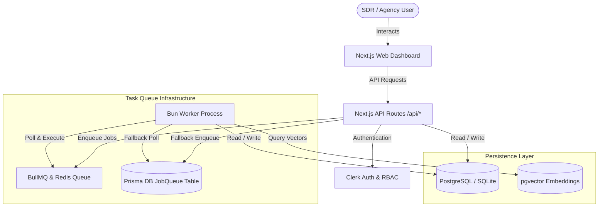
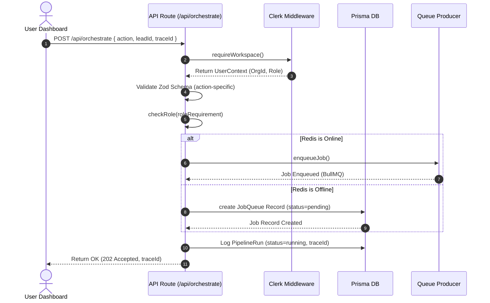
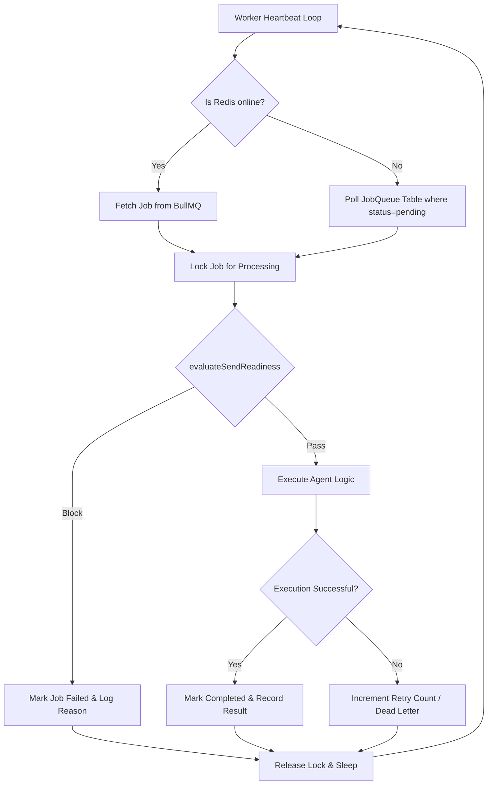
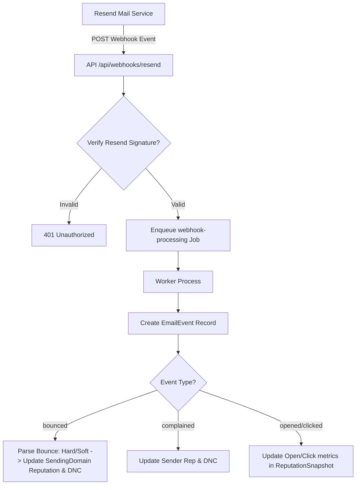
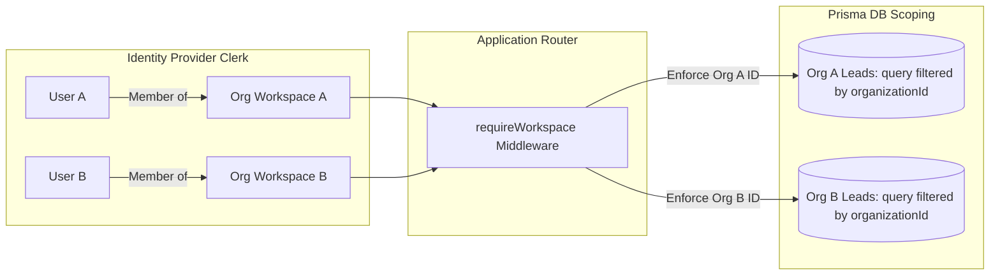
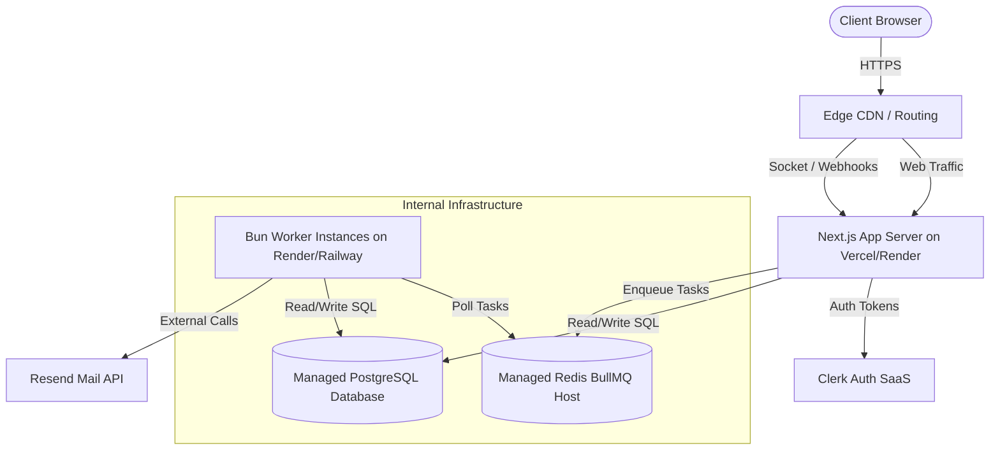

# System Architecture Guide — Proactive Outreach Agent

This document defines the architectural blueprints, system boundaries, and processing pipelines of the Proactive Outreach Agent.

---

## 1. System Overview

The application comprises four primary layers: the Next.js Web Dashboard, Next.js API Routes, the background processing worker pool, and the data engines (Prisma relational database + Redis queue).

---

## 2. System Data Flow

The following diagram maps the lifecycle of a lead through the 4-phase autonomous cycle:

```mermaid
graph LR
    LeadImport[Lead Import] -->|Observe Phase| Enrichment[Enrichment & Scraping]
    Enrichment -->|Extract Signals| SignalInt[Signal Intelligence]
    SignalInt -->|Think Phase| LeadScoring[Lead & Signal Scoring]
    LeadScoring -->|Strategy Selector| Strategy[Outreach Strategy Selection]
    Strategy -->|Act Phase| MsgDraft[Outreach Message Draft]
    MsgDraft -->|Human Approval| Approved[Approved Message]
    Approved -->|Send Readiness Check| Sent[Sent via Resend]
    Sent -->|Re-evaluate Phase| Replies[Reply Classification]
    Replies -->|Feedback Loop| AgentMem[Agent Memory]
    AgentMem -->|Update Rules| Strategy
```

---

## 3. Request Lifecycle

The API requests lifecycle, focusing on the `/api/orchestrate` endpoint, enforces strict validation, security context checks, and async task delegation:

---

## 4. Worker Pipeline Run

The background worker manages job execution asynchronously, with a safe fallback mechanism if Redis is offline:

---

## 5. Webhook Ingestion Pipeline

All external delivery events are received, validated, and processed asynchronously via the Resend webhook endpoint:

---

## 6. Tenant Isolation Boundaries

Data and access control boundaries prevent any leakage between organization workspaces:

---

## 7. Deployment Topology

The production setup utilizes high-availability hosting with decoupled web and background worker services:

---

## 8. Failure Mode & Fallback Engineering

| Failure Mode | Detection Indicator | Architectural Fallback / Remediation |
| :--- | :--- | :--- |
| **Redis Outage** | Connection refused, timeout on enqueue | Instantly switches to DB-backed `JobQueue` fallback. The UI dashboard displays job status by querying `JobQueue` records. Workers poll the database using standard locks. |
| **LLM Provider Timeout** | HTTP 504 / connection timeout in `llm-reasoning.ts` | The agent catches the error, increments retry count, and backs off. If retries fail, it falls back to a template-driven pitching model using default campaign offers. |
| **Resend API Over Limit** | HTTP 429 Rate Limit Exceeded | The `EmailSenderAgent` rescheduling mechanism detects the 429 status and schedules the message back into the queue with an exponential delay offset. |
| **Domain Reputation Drop** | Domain reputation score falls below 30 | The `evaluateSendReadiness` check blocks any further enqueued sends for the domain. An Activity log and Alert are generated, notifying the admin to pause the campaign or rotate domain pools. |
| **Clerk API Down** | Authentication verification failure | The application middleware falls back to checking localized Dev-Auth bypass keys if configured in the environment, preventing local lockout during third-party outages. |
