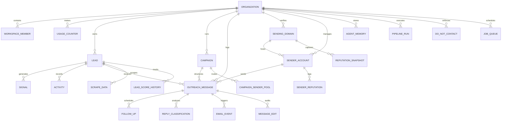
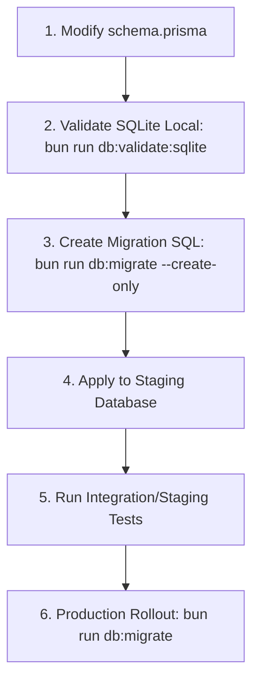

# Database Schema Specification — Proactive Outreach Agent

This document defines the schema, constraints, relations, and indexes of the Proactive Outreach Agent database. The database is represented by 23 core models using PostgreSQL in production and SQLite for local development.

---

## 1. Entity Relationship (ER) Diagram

The following Mermaid entity relationship diagram displays the core relationships of the schema.

---

## 2. Core Models and Field Definitions

Here we document the primary models driving the Observe, Think, Act, and Re-evaluate pipelines:

### 1. `Organization`
The root tenant model. All application data (except global config) is scoped to an Organization.
- `id` (String, PK): Unique Organization identifier.
- `workspaceKey` (String, Unique): User-friendly workspace identifier.
- `clerkOrgId` (String, Unique): Clerk Authentication mapping ID.
- `plan` (Enum: `free`, `starter`, `growth`, `agency`, `enterprise`): The pricing and limit tier.
- `subscriptionStatus` (Enum: `trialing`, `active`, `past_due`, `canceled`, `unpaid`, `incomplete`, `none`).

### 2. `Lead`
Represents the target prospect.
- `id` (String, PK): Lead ID.
- `organizationId` (String, FK): Links to Organization.
- `email` (String): Lead email address (Unique per organization).
- `status` (String): Lead status lifecycle (`new` → `enriched` → `scored` → `generated` → `approved` → `sent` → `replied` → `interested`/`negative`/`unsubscribed`).
- **Scoring Fields**: `leadScore` (0-100 composite), `signalScore` (0-100 buying intent), `replyProb` (0-1 probability), `conversionProb` (0-1 conversion potential), `spamRisk` (0-1 risk score), `priorityTier` (`hot`, `warm`, `cold`).
- **Autonomy Fields**: `autonomyEnabled` (Boolean), `nextActionAt` (DateTime), `lastAutonomousRun` (DateTime).

### 3. `Signal`
Timely buying signals extracted during the Observe phase.
- `id` (String, PK): Signal ID.
- `type` (String): e.g. `funding_round`, `hiring_spike`, `tech_stack_migration`, `seo_decline`, etc.
- `relevance` & `confidence` (Float, 0.0 - 1.0): Metric weights.
- `urgency` (Float, 0.0 - 1.0): Time-decay weighting score.
- `decayRate` (Float): Hourly/daily decay coefficient (default: 0.02).
- `expiresAt` (DateTime): Signal expiration limit.

### 4. `Campaign`
Outreach framework definition.
- `id` (String, PK): Campaign ID.
- `status` (String): `draft`, `running`, `paused`, `completed`, `archived`.
- `maxDailySends` (Int): Rate limits for campaign runs.
- **Autonomy Controls**: `autonomyEnabled` (Boolean), `autoApprovalEnabled` (Boolean), `spamRiskThreshold` (Float), `bounceRatePauseThreshold` (Float, default: 0.03).

### 5. `OutreachMessage`
Audited record of generated, approved, and dispatched outreach.
- `id` (String, PK): Message ID.
- `status` (String): `draft`, `generated`, `approved`, `sent`, `delivered`, `bounced`, `replied`.
- `strategy` (String): Chosen outreach strategy name (e.g. `signal-led`, `job-change`).
- `angle` & `tone` & `cta` (String): Message properties.
- `leadId` (String, FK): Links to Lead.
- `campaignId` (String, FK): Links to Campaign.
- `senderId` (String, FK): Links to SenderAccount.

### 6. `AgentMemory`
The primary learning storage structure.
- `id` (String, PK): Memory identifier.
- `category` (String): e.g., `winning_hook`, `persona_pattern`, `signal_correlation`.
- `key` (String): Lookup key (e.g., `saas_cto_funding`).
- `value` (String): JSON payload representing learned parameters.
- `score` (Float): Calculated effectiveness score (0.0 - 1.0).
- `embedding` (Unsupported("vector")): Vector column for semantic similarity (PostgreSQL pgvector support).

---

## 3. Database Indexes and Constraints

To enforce data integrity and performance under high read/write loads:

### Tenant Scoping Constraints
- **Lead Email Uniqueness**: `@@unique([organizationId, email])` — prevents a single tenant organization from importing duplicate leads while allowing different organizations to have the same lead.
- **Sending Domain Uniqueness**: `@@unique([organizationId, domain])` — isolates outbound domains by tenant.

### Performance Indexes
- **Lead Queries**: Index on `[organizationId, status]` and `[organizationId, leadScore]` to optimize lead search and dashboard rendering.
- **Queue Fallback polling**: Index on `[status, scheduledAt]` in `JobQueue` to allow background workers to poll pending tasks under 5ms.
- **Observability**: Indexes on `traceId` in `PipelineRun` and `JobQueue` to enable trace retrieval.

---

## 4. Database Migration Strategy

When deploying enhancements or new tables (such as additions for the Strategy Engine):

### Rollback Strategy
1. **Backward Compatibility**: Column updates must be additive. Deprecated fields must remain optional and nullable until adjacent codebases have fully migrated.
2. **Prisma Migrate Rollback**: In case of a migration failure in production, the migration state will be resolved via `prisma migrate resolve --rolled-back <migration_name>` and standard schema restoration via transactional backups.
3. **Database Backup Policy**: Automated snapshots are executed immediately prior to applying migrations on production clusters.
