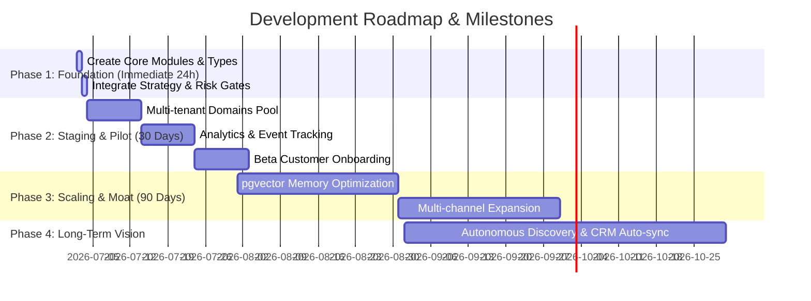

# Implementation Roadmap — Proactive Outreach Agent

This document defines the development steps, folder recommendations, execution timelines, milestones, dependencies, and risk mitigation profiles for the Proactive Outreach Agent.

---

## 1. Development Timeline & Milestones

The roadmap is structured into four distinct execution phases:



---

## 2. Four-Stage Execution Roadmap

### Stage 1: Immediate Priorities (Next 24 Hours)
- **Objective**: Implement working modules for `src/lib/strategy/` and `src/lib/risk/`, and integrate them into the Orchestrator.
- **Milestones**:
  - [ ] Initialize `src/lib/strategy/types.ts` and strategies.
  - [ ] Implement `src/lib/strategy/index.ts` containing selection logic for all 13 strategies, entry/exit conditions, and the confidence formula.
  - [ ] Implement `src/lib/risk/circuit-breaker.ts` containing tracking limits and threshold gates.
  - [ ] Integrate both modules into the Think and Act phases of `src/lib/orchestrator/index.ts`.
  - [ ] Verify execution runs and passes all 152 smoke and 62 architecture tests.

### Stage 2: Short-Term Goals (30 Days)
- **Objective**: Harden deliverability, verify multi-tenant isolation under higher load, and launch a pilot program.
- **Milestones**:
  - [ ] Implement domain verification tracking and fallback failover rules within `CampaignSenderPool`.
  - [ ] Create dashboard analytics showing reputation scores, bounce logs, and active warmup steps.
  - [ ] Deploy staging pipeline to Render/Fly.io using managed PostgreSQL and Redis clusters.
  - [ ] Onboard 3-5 pilot agency tenants to validate performance and catch edge-case bounce patterns.

### Stage 3: Medium-Term Goals (90 Days)
- **Objective**: Enhance the strategic feedback loop using semantic memory, and expand channel coverage.
- **Milestones**:
  - [ ] Optimize the `AgentMemory` PGVector search, enabling semantic similarity matching for persona patterns and winning hooks.
  - [ ] Implement LinkedIn and SMS outreach channels alongside the email pipeline.
  - [ ] Add automated lead cleaning API connections to check email addresses before enqueuing.

### Stage 4: Long-Term Vision (Beyond 90 Days)
- **Objective**: Establish the Proactive Outreach Agent as the central autonomous system for outbound campaigns.
- **Milestones**:
  - [ ] Introduce a fully autonomous discovery agent that crawls search engines and LinkedIn lists to ingest high-value leads.
  - [ ] Deep two-way integration with CRMs (Salesforce, HubSpot) to log activities, extract opportunities, and sync DNC lists.
  - [ ] Dynamic campaign optimization where the system autonomously generates new copy variations based on performance data.

---

## 3. Recommended Project Folder Structure

To preserve modularity and testability, new files should be organized as follows:

```
src/lib/
├── strategy/                      # Strategy Engine Module
│   ├── index.ts                   # StrategySelector, entry/exit conditions, confidence scoring, orchestration
│   └── types.ts                   # Strategy interfaces, StrategyName union, output schemas
├── risk/                          # Risk Management Module
│   ├── index.ts                   # evaluateRisk(): strategy risk, budget pacing, sender pool health
│   └── circuit-breaker.ts         # Threshold evaluation, domain locking, campaign auto-pause
└── orchestrator/
    └── index.ts                   # Main orchestrator (extended to import strategy/risk modules)
```

---

## 4. Key Execution Dependencies & Risk Matrix

| Risk / Dependency | Impact | Probability | Mitigation Strategy |
| :--- | :--- | :--- | :--- |
| **Redis Queue Disconnection** | High | Medium | Implemented a dual-tracked DB fallback queue (`JobQueue` table). If Redis goes offline, background workers query the database directly. |
| **Burned Domains / IP Blacklists** | Critical | Low | Enforce strict warmup limits, automatic circuit breakers, and bounce rate tracking. Maintain a reputation score threshold of $\ge 30$. |
| **LLM Hallucinations / Spam Copy** | Medium | Medium | Maintain an approval-first sending workflow as the default. Incorporate a pre-send spam risk check and provide tools to easily edit drafts. |
| **Clerk API Outage** | Medium | Low | Integrate local fallback JWT/Session bypass configs (`AUTH_DEV_BYPASS`) for development environments. |
