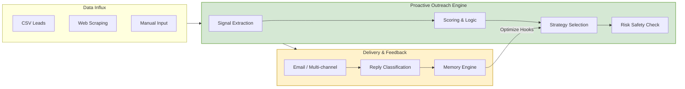

# Product Requirements Document (PRD) — Proactive Outreach Agent

## 1. Problem Statement & Market Opportunity

Traditional B2B outbound sales platforms are reactive, manual, and fragile:
- **Lead Discovery & Enrichment**: Sales development representatives (SDRs) manually scrape websites, build spreadsheets, and lack real-time context.
- **Static Copywriting**: Sequence builders use rigid, template-based structures that feel like spam, resulting in low response rates and domain blocklists.
- **Safety & Deliverability Violations**: Mass email sending leads to high bounce rates, spam complaints, and burned domains without automated pacing, warmup, or Do-Not-Contact (DNC) safety checks.
- **Feedback Deficits**: Systems fail to learn from human edits (which are gold) or reply sentiment, discarding the strategic loop.

The **Proactive Outreach Agent** addresses this by providing an autonomous, closed-loop outbound system that acts as an intelligent sales operations team: discovering buying signals, selecting tailored campaigns, drafting context-aware messaging with a human-in-the-loop approval mechanism, executing sends safely, and continuously learning from reply outcomes and human edits.

---

## 2. User Personas & User Stories

### Target User Personas
1. **Sarah (SDR Lead at a B2B SaaS Startup)**: Needs to book 15-20 qualified demo calls monthly. Spends 70% of her day copying/pasting lead data and writing emails. Expects high-quality personalized drafts, easy approval queues, and zero domain safety issues.
2. **David (Agency Owner, B2B Lead Gen)**: Manages outreach for 10 client companies. Needs multi-tenant/organization isolation, domain pool management, and robust deliverability tools to keep client domains safe.
3. **Elena (VP of Sales)**: Focuses on metrics (reply rate, conversion, pipeline). Needs high-level analytics, automated scoring, and strategy learning to identify which hooks and angles drive the highest ROI.

### User Stories
- **Lead Import & Processing**: *As Sarah, I want to upload a CSV of raw leads or input a single company URL so that the system autonomously scrapes the site, extracts buying signals, and determines our best pitch angle.*
- **Outreach Strategy Selection**: *As Sarah, I want the system to dynamically score and choose the best strategy (e.g. funding, tech migration) for each lead so that I don't send generic, misaligned pitches.*
- **Human-in-the-Loop Review**: *As Sarah, I want to approve or edit AI-generated drafts on a centralized board so that I maintain full control over what goes out, and have the system learn from my edits.*
- **Domain Reputation Safety**: *As David, I want the system to automatically enforce domain warmup limits and block sends if a domain's bounce rate exceeds 3% so that our delivery reputation is preserved.*
- **Multi-Tenant Administration**: *As David, I want strict tenant boundaries between my client workspace organizations so that data, pools, and keys never leak across accounts.*

---

## 3. Product Evaluation & Viability Assessment

This section details how different audiences evaluate the viability of the Proactive Outreach Agent.

### Hackathon / Demo Viability
- **The Wow Factor**: Live demonstration of a lead being imported, scraped, a custom buying signal (e.g. funding round or hiring spike) being extracted, and an email draft instantly appearing with high-fidelity, context-aware reasoning.
- **Technical completeness**: Fully integrated database (PostgreSQL/SQLite), background processing (BullMQ / DB-backed JobQueue), and active safety gates (DNC list checks, Resend API checks).
- **Execution Risk**: Low. Built on Next.js 16 and SQLite/PostgreSQL, runs locally or in staging without complex external dependencies.

### Startup Viability (SaaS Model)
- **Customer Acquisition Cost (CAC) vs. LTV**: High LTV. Agencies and SaaS companies pay \$100-\$500/month for automated SDR systems. Low initial CAC due to developer/sales ops-led adoption.
- **The Moat (Defensibility)**: 
  1. *Agent Memory*: The system builds a proprietary dataset of which signal-hook correlations yield replies within specific industries/personas.
  2. *Deliverability Engine*: The integrated warmup, sender pooling, and safety validation mechanism prevent the standard "spam-and-burn" cycle, providing structural reliability.
- **Unit Economics**: Resend ($0.80/1k emails) and LLM costs ($0.02/lead run) allow for extremely high margins (>90%).

### Investor / Judge Perception
- **The Pitch**: "An autonomous sales outbound OS that writes like your best SDR, delivers safely, and grows smarter with every reply."
- **Key Validation Points**:
  - Focuses on *signal-led* high-value outreach rather than mass automated spam.
  - Implements a *Human-in-the-Loop* approval mechanism to guarantee quality control and prevent PR disasters.
  - Incorporates *strict deliverability safeguards* (warmup schedules, circuit breakers, domain reputation scoring) as a core product feature rather than an afterthought.

---

## 4. System Value Proposition & Capabilities

### Feature Matrix

| Feature | Description | Status in Phase 1 | Future Phase |
| :--- | :--- | :--- | :--- |
| **Lead Ingestion & Parsing** | Handles CSV imports, manual leads, and duplicates safely. | **Implemented** | Auto-enrichment via APIs |
| **Signal Extraction** | Analyzes crawled sites for 16+ signals (funding, hiring spikes, etc.). | **Implemented** | Real-time news API checks |
| **Outreach Scoring** | Dynamic scoring of lead fit, signal strength, and priority tier. | **Implemented** | Custom weight modeling |
| **Strategy Selection** | Scores and maps leads to 13 distinct strategies (R2). | **Design Ready** | Adaptive sequence generation |
| **HITL Approval Board** | Allows users to edit, approve, or reject generated outreach drafts. | **Implemented** | Split testing (A/B testing) |
| **Deliverability Safeguards** | Integrates 15+ safety gates, warmup, DNC, and domain checks. | **Implemented** | Multi-domain rotating pools |
| **Risk Circuit Breakers** | Automatically pauses campaigns exceeding bounce/complaint limits. | **Design Ready** | Automatic alternative routing |
| **Agent Memory Feedback** | Saves hooks, edits, and reply outcomes to pgvector/JSON memory. | **Implemented** | Auto-tuning prompt templates |
