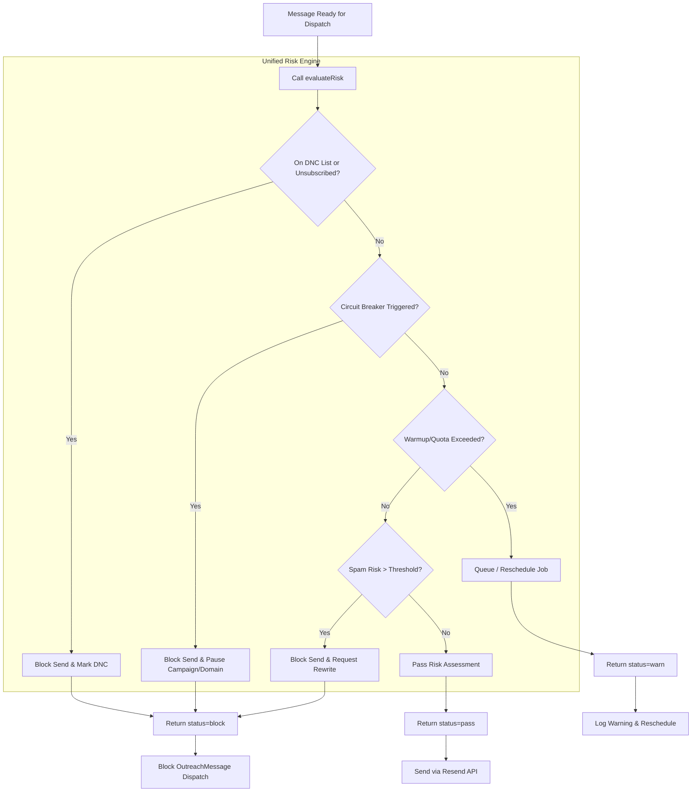

# Risk Management & Deliverability Gates — Proactive Outreach Agent

This document defines the safeguards, circuit breakers, warmup limitations, and risk assessment protocols implemented at `src/lib/risk/` and integrated with `evaluateSendReadiness()`.

---

## 1. Unified Risk Evaluation Pipeline

The risk engine ensures that no message is sent without passing all structural, reputation, and compliance checks:

---

## 2. Deliverability Circuit Breaker Policy

The circuit breaker engine monitors domain performance and automatically blocks outbound actions if deliverability metrics degrade below acceptable thresholds:

| Metric Gate | Warning Threshold | Block/Pause Threshold | Remediation & Restoration Protocol |
| :--- | :--- | :--- | :--- |
| **Domain Bounce Rate** | $\ge 2.0\%$ | $\ge 3.0\%$ | 1. Automatically pause active campaigns routing through this domain. 2. Queue database-wide validation for all pending leads. 3. Require admin review of the lead source before resumption. |
| **Domain Complaint Rate** | $\ge 0.05\%$ | $\ge 0.1\%$ | 1. Immediately pause sending on the affected domain. 2. Auto-blacklist complained addresses. 3. Cooldown domain for 48 hours and notify the workspace administrator. |
| **Unsubscribe Rate** | $\ge 1.5\%$ | $\ge 2.0\%$ | 1. Log warnings and downgrade strategy priority. 2. Force insertion of prominent unsubscribe options. 3. If threshold matches $2.0\%$, pause campaign sends. |
| **DNS Verification Status** | SPF/DKIM/DMARC warning | SPF/DKIM/DMARC missing | 1. Block sending immediately. 2. Run live DNS resolver diagnostic tests. 3. Resume sending only after verification status is confirmed. |

---

## 3. Warmup Schedule & Quota Rules

To build and maintain sender reputation:

### 30-Day Warmup Schedule
New sending domains start at Day 1 and step up limits daily as follows:
- **Day 1-5**: 5 emails/day per domain.
- **Day 6-10**: 10 emails/day per domain.
- **Day 11-15**: 25 emails/day per domain.
- **Day 16-20**: 50 emails/day per domain.
- **Day 21-30**: 100 emails/day per domain.
- **Day 31+**: Full campaign daily limits (up to 250 emails/day per domain).

### Pacing and Quotas
1. **Sender Pool Allocation**: Campaigns route messages through a `CampaignSenderPool`. The pool redistributes load away from warmup-throttled or unhealthy domains.
2. **Hourly Batching**: Sends are spread evenly across business hours, avoiding bulk bursts that trigger provider spam flags.
3. **Queue Health Lock**: If Redis or BullMQ latency increases, sends are paused to prevent database lockups.

---

## 4. Content Risk & Spam Evaluation

Before enqueuing, the AI output is analyzed for content compliance:
- **Spam Trigger Words**: Scanned for high-frequency promotional phrases (e.g. "free gift", "guaranteed revenue", "risk-free deal").
- **LLM Spam Risk Score**: The `ScoringEngine` evaluates each drafted body. If the `spamRisk` rating is $\ge 0.25$, the message is returned to the approval board with a warning description, requiring manual correction.

---

## 5. Safe Fallbacks & API Outage Handling

The system maintains functional capabilities when downstream services are offline:

- **LLM Outage Fallback**: If the OpenAI/LLM API times out or fails during drafting, the strategy engine falls back to generating structured template-based copy using fields from `Campaign` (default pitch text, campaign CTA, and target value proposition).
- **Email Verification Fallback**: If the external email verification service is down, the system enforces a strict regex validator and queries the internal `DoNotContact` table, defaulting to `unverified` status while allowing manual approval override.
- **Redis Outage Queue Fallback**: If Redis crashes, the application continues to run. Jobs are recorded in the database `JobQueue` table, and the worker script executes in a polling fallback loop.
