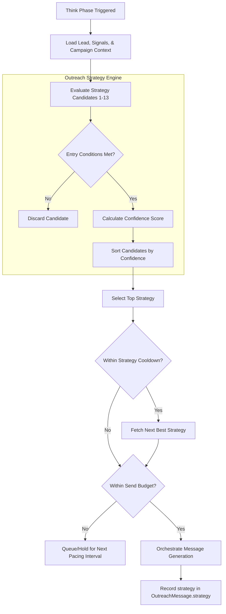

# Strategy Engine Architecture — Proactive Outreach Agent

This document defines the architecture, formulas, selection criteria, conflict resolution, and implementation logic for the Proactive Outreach Strategy Engine.

---

## 1. Pipeline Overview & Selector Flow

The Strategy Engine runs during the **Think** phase. It selects, scores, and schedules outreach strategies based on lead metadata, signal intelligence, deliverability states, and historical response performance from `AgentMemory`.



---

## 2. Confidence Scoring Formula

Each candidate strategy is evaluated against a dynamic confidence score model:

$$\text{Confidence Score} = (S_{\text{confidence}} \times 0.4) + (L_{\text{fit}} \times 0.3) + (M_{\text{perf}} \times 0.3)$$

Where:
- $S_{\text{confidence}}$: The confidence score of the triggering signal ($0.0 - 1.0$). For non-signal-based strategies (like Persona-based), this defaults to $0.5$.
- $L_{\text{fit}}$: The lead fit rating derived from the `ScoringEngine` ($0.0 - 1.0$).
- $M_{\text{perf}}$: Historical success score of this specific strategy key retrieved from `AgentMemory` ($0.0 - 1.0$, defaults to $0.5$ if no memory is present).

---

## 3. Detailed Strategy Breakdown (Strategies 1-13)

### Strategy 1: Signal-led Outreach
- **Required Data**: Lead record, at least one high-confidence active `Signal`.
- **Inputs**: `Lead`, `Signal`.
- **Outputs**: Selected strategy context, trigger signal type, and reasoning payload.
- **Entry Conditions**: Signal confidence $\ge 0.7$; Signal urgency $\ge 0.5$; Signal has not expired (`expiresAt` is null or in the future).
- **Exit Conditions**: Lead moves out of `new` or `scored` status, or signal is marked resolved/expired.
- **Decision Rules**: Trigger if no more specific event strategy (funding, hiring) matches.
- **Budget Allocation**: High priority. Allocates 1 send credits from daily domain limit.
- **AI Role**: Explain why the signal was detected and connect it directly to the campaign offer.
- **Fallbacks**: Fall back to "Persona-based outreach" if the signal snippet cannot be parsed.
- **Pseudocode**:
  ```typescript
  if (lead.status === 'scored' && signals.some(s => s.confidence >= 0.7 && s.urgency >= 0.5)) {
    return { strategy: 'signal-led', confidence: calculateScore(signals[0], lead) };
  }
  ```

### Strategy 2: Funding/growth Event Outreach
- **Required Data**: `Signal` where type is `funding_round` or `growth`.
- **Inputs**: `Lead`, `Signal` (funding round amount/date).
- **Outputs**: Personalized pitch angle based on growth trajectory.
- **Entry Conditions**: Signal type matches `funding_round` or `growth` within the last 45 days.
- **Exit Conditions**: Contact replies or campaign is paused due to budget.
- **Decision Rules**: Prioritize if funding amount exceeds \$1M.
- **Budget Allocation**: Premium daily pacing. Direct sender account matching.
- **AI Role**: Congratulate the target on funding and position the offer as a scaling aid.
- **Fallbacks**: Fall back to standard Signal-led outreach if funding details are missing.
- **Pseudocode**:
  ```typescript
  const fundingSignal = signals.find(s => s.type === 'funding_round' || s.type === 'growth');
  if (fundingSignal && (Date.now() - fundingSignal.detectedAt.getTime() < 45 * 24 * 60 * 60 * 1000)) {
    return { strategy: 'funding-growth', confidence: calculateScore(fundingSignal, lead) };
  }
  ```

### Strategy 3: Hiring Spike Outreach
- **Required Data**: `Signal` of type `hiring_spike` or `engineering_hiring_spike`.
- **Inputs**: `Lead`, `Signal` (departments hiring, open roles count).
- **Outputs**: Message angle tailored to hiring bottlenecks.
- **Entry Conditions**: Presence of active hiring signal detected within 30 days.
- **Exit Conditions**: Campaign completes or lead is unsubscribed.
- **Decision Rules**: Map open jobs to the sender's solution area (e.g. engineering hiring spike matches outsourcing offer).
- **Budget Allocation**: 1 send credit.
- **AI Role**: Address the pain of onboarding, scaling engineering departments, or resource shortages.
- **Fallbacks**: Persona-based outreach targeting VP of HR/Engineering.
- **Pseudocode**:
  ```typescript
  const hiringSignal = signals.find(s => s.type === 'hiring_spike' || s.type === 'engineering_hiring_spike');
  if (hiringSignal && (Date.now() - hiringSignal.detectedAt.getTime() < 30 * 24 * 60 * 60 * 1000)) {
    return { strategy: 'hiring-spike', confidence: calculateScore(hiringSignal, lead) };
  }
  ```

### Strategy 4: Job Change Outreach
- **Required Data**: `Signal` of type `job_change` (contact recently took a new role).
- **Inputs**: `Lead`, `Signal` (previous company, new title).
- **Outputs**: Welcome/congratulations message context.
- **Entry Conditions**: Signal type is `job_change` and the transition date is within the last 90 days.
- **Exit Conditions**: Lead responds or moves to bounced state.
- **Decision Rules**: Frame the transition as an opportunity to implement new structures.
- **Budget Allocation**: Capped at 1 send. High deliverability sender account selected.
- **AI Role**: Leverage the new role context to introduce a 30-60-90 day planning tool or service.
- **Fallbacks**: Standard persona-based outreach.
- **Pseudocode**:
  ```typescript
  const jobChange = signals.find(s => s.type === 'job_change');
  if (jobChange && (Date.now() - jobChange.detectedAt.getTime() < 90 * 24 * 60 * 60 * 1000)) {
    return { strategy: 'job-change', confidence: calculateScore(jobChange, lead) };
  }
  ```

### Strategy 5: Tech Stack Migration Outreach
- **Required Data**: `Signal` of type `tech_stack_migration`.
- **Inputs**: `Lead`, `Signal` (framework added or dropped).
- **Outputs**: Pitch angle showing technical migration compatibility.
- **Entry Conditions**: Migration signal detected with confidence score $\ge 0.6$.
- **Exit Conditions**: Lead replies or sequence finishes.
- **Decision Rules**: Focus on integration services or tools that ease the transition.
- **Budget Allocation**: 1 send credit.
- **AI Role**: Position the sender as an expert in the newly adopted framework.
- **Fallbacks**: General signal-led outreach.
- **Pseudocode**:
  ```typescript
  const migration = signals.find(s => s.type === 'tech_stack_migration');
  if (migration && migration.confidence >= 0.6) {
    return { strategy: 'tech-migration', confidence: calculateScore(migration, lead) };
  }
  ```

### Strategy 6: Traffic Drop / SEO Decline Outreach
- **Required Data**: `Signal` of type `traffic_drop` or `seo_decline`.
- **Inputs**: `Lead`, `Signal` (percentage traffic loss, key search terms dropped).
- **Outputs**: Recovery roadmap pitch angle.
- **Entry Conditions**: Traffic drop magnitude $\ge 15\%$ month-over-month.
- **Exit Conditions**: Contact responds or is blacklisted.
- **Decision Rules**: Trigger only for companies where digital acquisition is critical.
- **Budget Allocation**: Standard send credits.
- **AI Role**: Consultative, showing the drop metrics and presenting a fix.
- **Fallbacks**: Competitor pressure outreach.
- **Pseudocode**:
  ```typescript
  const seoDrop = signals.find(s => s.type === 'traffic_drop' || s.type === 'seo_decline');
  if (seoDrop && seoDrop.relevance >= 0.7) {
    return { strategy: 'traffic-seo-decline', confidence: calculateScore(seoDrop, lead) };
  }
  ```

### Strategy 7: Competitor Pressure Outreach
- **Required Data**: `Signal` of type `competitor_pressure`.
- **Inputs**: `Lead`, `Signal` (competitor names, market shift).
- **Outputs**: Comparative benefit pitch angle.
- **Entry Conditions**: Signal contains verified competitor product adoption.
- **Exit Conditions**: Lead replies or campaign pauses.
- **Decision Rules**: Highlight features where the sender outperforms the named competitors.
- **Budget Allocation**: 1 send credit.
- **AI Role**: consultative, focus on differentiation and ROI advantages.
- **Fallbacks**: Persona-based outreach.
- **Pseudocode**:
  ```typescript
  const compPressure = signals.find(s => s.type === 'competitor_pressure');
  if (compPressure) {
    return { strategy: 'competitor-pressure', confidence: calculateScore(compPressure, lead) };
  }
  ```

### Strategy 8: AI Adoption Outreach
- **Required Data**: `Signal` of type `ai_adoption` or `ai_adoption_signal`.
- **Inputs**: `Lead`, `Signal` (AI tools deployed, job postings calling for AI).
- **Outputs**: AI integration pitch angle.
- **Entry Conditions**: Active AI signal detection within 60 days.
- **Exit Conditions**: Lead reacts or enters DNC status.
- **Decision Rules**: Align pitch with the organization's technical maturity.
- **Budget Allocation**: Standard send.
- **AI Role**: Tailor the messaging around efficiency, scaling models, or AI workflows.
- **Fallbacks**: Tech stack migration outreach.
- **Pseudocode**:
  ```typescript
  const aiSignal = signals.find(s => s.type === 'ai_adoption' || s.type === 'ai_adoption_signal');
  if (aiSignal) {
    return { strategy: 'ai-adoption', confidence: calculateScore(aiSignal, lead) };
  }
  ```

### Strategy 9: Persona-based Outreach
- **Required Data**: Lead title/role, AgentMemory configurations.
- **Inputs**: `Lead` (title, department).
- **Outputs**: Value proposition targeted at the specific buyer persona.
- **Entry Conditions**: No high-urgency signals present, but Lead title matches targeted personas in `AgentMemory`.
- **Exit Conditions**: Lead moves through standard 3-step sequence without reply.
- **Decision Rules**: Fallback strategy for general database nurturing.
- **Budget Allocation**: Low priority. Uses remaining campaign quota.
- **AI Role**: Speak to typical daily problems faced by the persona (e.g. CTO: reliability/costs).
- **Fallbacks**: General corporate offer email.
- **Pseudocode**:
  ```typescript
  if (lead.title && matchesPersonaPattern(lead.title)) {
    return { strategy: 'persona-based', confidence: 0.5 };
  }
  ```

### Strategy 10: Personalization-hook Outreach
- **Required Data**: `Signal` of type `personalization_hook` (e.g. quote from podcast, blog post).
- **Inputs**: `Lead`, `Signal` (the quote or reference snippet).
- **Outputs**: Highly customized introduction line.
- **Entry Conditions**: Relevance score of hook $\ge 0.8$.
- **Exit Conditions**: Lead responds.
- **Decision Rules**: Prioritize as an icebreaker hook.
- **Budget Allocation**: 1 send. High-reputation sender account.
- **AI Role**: Reference the hook naturally in the first 2 sentences.
- **Fallbacks**: Signal-led outreach.
- **Pseudocode**:
  ```typescript
  const hook = signals.find(s => s.type === 'personalization_hook');
  if (hook && hook.relevance >= 0.8) {
    return { strategy: 'personalization-hook', confidence: calculateScore(hook, lead) };
  }
  ```

### Strategy 11: Follow-up and Re-engagement
- **Required Data**: Prior sent `OutreachMessage` without replies, time offset.
- **Inputs**: Previous message context, campaign follow-up offset schedule.
- **Outputs**: Contextual bump or value-add message.
- **Entry Conditions**: Days since last contacted matches campaign follow-up day offset (e.g., day 3, 7, or 14).
- **Exit Conditions**: Lead replies, unsubscribes, or reaches the end of the sequence.
- **Decision Rules**: Check DNC status and that no replies were received.
- **Budget Allocation**: Auto-approved. High priority to complete active threads.
- **AI Role**: Short, polite follow-up adding a new case study or reference.
- **Fallbacks**: End sequence.
- **Pseudocode**:
  ```typescript
  const lastMsg = lead.messages[0];
  if (lastMsg && lastMsg.status === 'sent' && shouldFollowUp(lastMsg, campaign.followUpSchedule)) {
    return { strategy: 'follow-up', confidence: 0.8 };
  }
  ```

### Strategy 12: Breakup / Final-touch
- **Required Data**: Lead message history showing 3+ unanswered touches.
- **Inputs**: Prior message count, sequence position.
- **Outputs**: Polite exit email.
- **Entry Conditions**: Prior outreach count $\ge 3$ and last contact was $\ge 10$ days ago.
- **Exit Conditions**: Sent. Lead is marked as `closed-no-reply`.
- **Decision Rules**: Execute only as the final email in the campaign sequence.
- **Budget Allocation**: Standard pacing.
- **AI Role**: Let the contact know this is the last attempt to reach them, offering a calendar link.
- **Fallbacks**: None.
- **Pseudocode**:
  ```typescript
  if (lead.messages.length >= 3 && daysSinceLastContact(lead) >= 10) {
    return { strategy: 'breakup', confidence: 0.9 };
  }
  ```

### Strategy 13: Reply-driven Follow-up
- **Required Data**: Incoming reply classified under `ReplyClassification`.
- **Inputs**: `ReplyClassification` (category, replyText).
- **Outputs**: Sentiment-adapted follow-up draft.
- **Entry Conditions**: Reply received and classified as `interested` or `needs_info`.
- **Exit Conditions**: Handed off to sales representative or booking link confirmed.
- **Decision Rules**: Trigger immediately upon webhook callback and classification.
- **Budget Allocation**: Top priority. Bypasses standard daily limits.
- **AI Role**: Answer the specific question asked in the reply, providing a booking link.
- **Fallbacks**: Escalation to owner email for manual drafting.
- **Pseudocode**:
  ```typescript
  const lastReply = lead.replies[0];
  if (lastReply && (lastReply.category === 'interested' || lastReply.category === 'needs_info')) {
    return { strategy: 'reply-driven', confidence: 0.95 };
  }
  ```

---

## 4. Conflict Resolution & Cooldown Rules

To prevent outreach collision (e.g. enqueuing multiple signals for the same lead in a single day):

1. **Strategic Hierarchy**: The Strategy Selector evaluates candidates and picks only the single highest-scoring strategy.
2. **Contact Cooldown**: A lead cannot receive another outreach message within a configurable campaign cooldown window (default: 3 days).
3. **Duplicate Gate**: The selector queries the `OutreachMessage` table for the lead. If the strategy was already executed within 30 days, the selector skips that strategy and picks the next available candidate in the confidence queue.
4. **Deliverability Throttle**: If the campaign's target domain is in a "Warming" stage, the orchestrator limits runs to ensure the daily warmup count is not exceeded.
