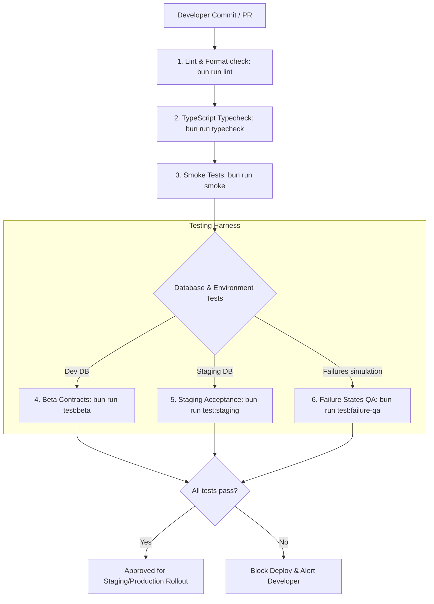

# Testing & Validation Strategy — Proactive Outreach Agent

This document defines the testing strategy, acceptance criteria, test harness conventions, and CI/CD validation gates for the Proactive Outreach Agent.

---

## 1. Testing Hierarchy & CI/CD Pipeline

The validation pipeline enforces linting, strict typing, functional testing, and environmental hardening before code is qualified for release:

---

## 2. Test Suites Specification

The test matrix covers all execution paths across three distinct categories:

### A. Unit Testing
- **Scope**: Codebases without external service connections (API, Database, Redis).
- **Target Files**:
  - `src/lib/safety.ts` (`validateEmail`, `parseCsv` parsing rules).
  - `src/lib/strategy/` (Dynamic formula evaluations, confidence calculations, rule matching).
  - `src/lib/deliverability/send-cadence.ts` (Sending delay offsets and warmup limit calculations).
- **Existing Suite**: `src/__tests__/smoke.test.ts` (Self-contained test runner, no framework required).

### B. Integration Testing
- **Scope**: Integration between modules, database connectivity, auth middleware boundaries, and queues.
- **Target Files**:
  - `src/lib/auth/context.ts` (RBAC access checks, Clerk organization boundary validation).
  - `src/lib/queue/` (BullMQ workers, jobs, Redis connection switches).
  - `src/lib/risk/` (Circuit breaker threshold counters, database-backed state transitions).
- **Existing Suite**: `src/__tests__/architecture.test.ts` & `src/__tests__/beta-contracts.test.ts`.

### C. End-to-End (E2E) & Hardening Testing
- **Scope**: Simulating user workflows and system failures (API timeouts, Redis crashes, unverified domain blocks).
- **Target Workflows**:
  1. **Outreach Flow**: Lead Import $\rightarrow$ Observe $\rightarrow$ Think $\rightarrow$ Approve $\rightarrow$ Send $\rightarrow$ Webhook callback.
  2. **Failure Flow**: Disable Redis mid-transit and verify job execution automatically falls back to SQL polling.
- **Existing Suite**: `src/__tests__/staging-acceptance.test.ts` & `src/__tests__/failure-state-qa.test.ts`.

---

## 3. Acceptance Criteria

| Product Feature | Technical Target | Validation Criteria |
| :--- | :--- | :--- |
| **Signal Extraction** | $100\%$ parsing of raw HTML/text into standard Signal models. | Verify that the `SignalExtractorAgent` successfully maps scraped careers pages to `hiring` and `hiring_spike` types. |
| **Strategy Selection** | Selecting the single best strategy according to context. | Assert that leads with `funding_round` signals are assigned the `funding-growth` strategy with high confidence. |
| **Risk Circuit Breaker** | Pause campaigns upon exceeding thresholds. | If `EmailEvent` triggers soft/hard bounces that push domain bounce rate to $3.5\%$, assert domain status updates to `suspended`. |
| **Human Approval** | Block non-approved messages. | Verify that a draft message cannot be sent via the API until its status is updated to `approved` by a user with the `member` or `admin` role. |
| **Tenant Isolation** | Zero cross-tenant data visibility. | Run parallel test calls. Assert that query operations under Org A context return zero records from Org B. |

---

## 4. Test Data Management & Lifecycle

To ensure consistent and repeatable testing:
1. **Isolated Test Database**: Local tests utilize a dedicated SQLite instance (`dev.db`). Production migrations are staged and validated against a clone of the PostgreSQL instance.
2. **Deterministic Seeds**: The system utilizes seed scripts (`prisma/seed.ts`) to populate mock organizations, sending domains, campaigns, and leads.
3. **Database Cleansing Policy**: Every integration run clears test tables (`Lead`, `OutreachMessage`, `Activity`, `Signal`, `PipelineRun`, `JobQueue`) after execution to prevent data contamination.
4. **Mock APIs**: External endpoints (Clerk JWT validation, Resend API send, OpenAI completion) are simulated via local mock implementations or developer bypass configurations (`AUTH_DEV_BYPASS=true`).
