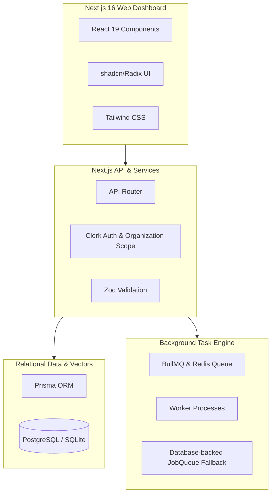

# Technical Requirements Document (TRD) — Proactive Outreach Agent

## 1. System Constraints & Tech Stack

The Proactive Outreach Agent is built on a modern, unified TypeScript stack designed for speed, type safety, and ease of deployment.

### Runtime Environment & Build Tools
- **Runtime**: Bun (recommended for local development and worker execution; `bun.lock` is tracked).
- **Framework**: Next.js 16 App Router (React 19, TypeScript strict mode).
- **ORM**: Prisma Client.
- **Queue/Worker Engine**: Redis + BullMQ (production) with custom DB-backed fallback (`JobQueue` table) for development or Redis outage conditions.
- **Auth Provider**: Clerk (with multi-tenant Organization and Role-Based Access Control).
- **Mail Service**: Resend API (with domain DNS records verification: SPF, DKIM, DMARC).

---

## 2. Non-Functional Requirements & Performance Targets

### Performance Requirements
- **Web UI Responsiveness**: Interactive dashboard pages (Lead tables, Activity feeds) must render within 200ms.
- **Scrape & Analysis Latency**: Web scraping and signal extraction should complete within 30 seconds per lead (asynchronous processing, decoupled from request-response lifecycle).
- **Queue Job Delay**: Standard queue scheduling latency must be under 1 second when Redis is online, and under 5 seconds when operating in database-fallback mode.

### Scalability Targets
- **Lead Volume**: Architecture must support importing up to 10,000 leads per organization batch.
- **Parallel Scraping**: Scraping and extraction queue concurrency target is 5 concurrent scraper jobs.
- **Email Dispatch Pacing**: Email sending worker concurrency is capped at 2 to enforce strict warmup limits and avoid sending surges that trigger spam filters.

### Security Requirements
- **Tenant Isolation**: Mandatory scoping of all database reads and writes by `organizationId`. Queries without organization filters are prohibited unless explicitly flagged for system-level operations.
- **Authentication & Authorization**: All `/api/orchestrate` endpoints must check session validity via Clerk and enforce Role-Based Access Control (RBAC):
  - `admin` role required for autonomy settings, starting cycles, and system configurations.
  - `member` role required for lead ingestion, drafting, and approvals.
  - `viewer` role restricted to read-only actions.
- **API Secret Storage**: Third-party API keys (Resend key, OpenAI key) must be referenced via environment variables or encrypted references in the database, never stored in raw database strings.

### Compliance & Deliverability Requirements
- **Do-Not-Contact (DNC) Compliance**: Immediate bounce/unsub tracking. The system must query the DNC list before enqueuing a message and re-check immediately before sending in the worker (`assertReadyToSend()`).
- **Unsubscribe Link Footer**: Every sent outreach message must include a valid unsubscribe footer link.
- **Rate Limits & Warming**: Sends must respect Resend's API limits and the domain's 30-day warmup schedule.

---

## 3. Hard Requirements vs. Explicit Assumptions

### Hard Requirements (Non-negotiable)
1. **Approval-First Design**: Messages must reside in `draft` or `generated` status until a user with the `member` or `admin` role clicks Approve, unless campaign-level `autoApprovalEnabled` is explicitly set to true.
2. **Trace ID Standard**: Every request must generate or propagate a `traceId`. Every log entry, background queue job, and API payload must include this `traceId` for end-to-end debugging.
3. **Dual Queue Modes**: The worker must dynamically adapt. If Redis is unavailable (`REDIS_URL` not connecting), the queue system must transparently fall back to querying and updating the `JobQueue` database table.

### Explicit Assumptions
1. **Assumed Clerk Token Availability**: It is assumed that Clerk is configured with organization support enabled. Local development can utilize a development bypass config if Clerk keys are omitted.
2. **Resend Single Account Scoping**: It is assumed that organizations verify domains they own inside the dashboard. We assume the organization has configured appropriate SPF/DKIM/DMARC records on their domain DNS panel before attempting verified sends.
3. **Background Worker Liveness**: We assume a background worker process (`bun run worker`) is running persistently in production. If the worker stops, jobs will queue up in BullMQ or the database-backed `JobQueue` table until restarted.
