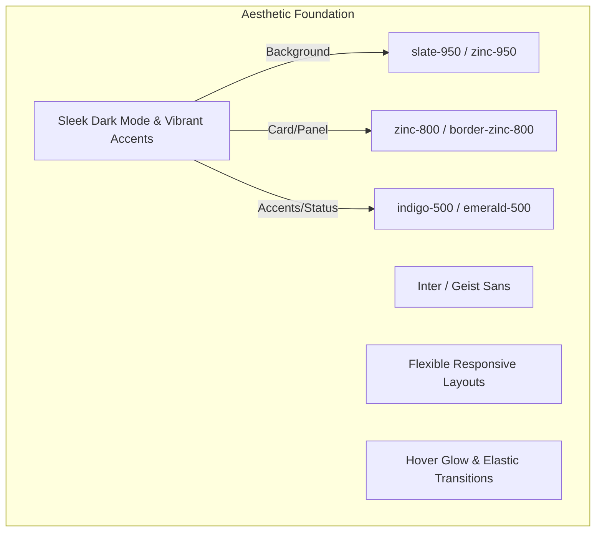

# UI/UX Design Brief — Proactive Outreach Agent

This document defines the interface architecture, design system, component layouts, state transitions, and user experience patterns for the Proactive Outreach Agent dashboard.

---

## 1. Design System & Aesthetics

The interface is built using a modern, sleek dark mode theme optimized for high information density, strategic control, and clean visibility.



### Color Palette (Tailwind Tokens)
- **Backgrounds**: `bg-zinc-950` (main surface), `bg-zinc-900` (cards and sections), `bg-zinc-900/50` (nested tables/lists).
- **Borders**: `border-zinc-800` (subtle separators), `border-zinc-700` (focused inputs/actions).
- **Typography**: `text-zinc-100` (primary headings), `text-zinc-400` (body/subheadings), `text-zinc-500` (muted labels/metadata).
- **Status Accents**:
  - **Success / Pass**: `text-emerald-400`, `bg-emerald-500/10` (circuit breakers green).
  - **Warning**: `text-amber-400`, `bg-amber-500/10` (elevated bounce rates/pacing warning).
  - **Block / Danger**: `text-rose-400`, `bg-rose-500/10` (unverified domains/blocked sends).

---

## 2. Dashboard Interface Layout

The dashboard is structured as a single-page application (SPA) with a persistent sidebar navigation and a tab-based view switching controller:

```
+----------------------------------------------------------------------------------+
|  [Sidebar Nav]  |  [Header Bar: Organization Switcher | Workspace Stats | Profile] |
|                 +----------------------------------------------------------------|
|  - Results      |                                                                |
|  - Approval     |  [Tabs: Results | Intelligence | Deliverability | Job Health]  |
|  - Leads        |                                                                |
|  - Campaigns    |  +----------------------------------------------------------+  |
|  - Settings     |  |                                                          |  |
|                 |  |                 [Tab Main Viewport]                      |  |
|                 |  |                                                          |  |
|                 |  +----------------------------------------------------------+  |
+----------------------------------------------------------------------------------+
```

### Component-Level View Breakdown

#### 1. Results Dashboard (`Results` Tab)
Displays aggregate pipeline metrics forming the "outbound results loop" (leads imported $\to$ signals found $\to$ drafts approved $\to$ messages sent $\to$ meetings booked).
- **Key Cards**: Primary conversion metrics with trend lines, hourly sending cadence heatmaps, and a live activity feed.
- **Visuals**:
  - [Results Initialized](/docs/screenshots/results_tab_init_1781885018634.png)
  - [Results Data View](/docs/screenshots/results_tab_qa_1781887747763.png)

#### 2. Signal Intelligence (`Intelligence` Tab)
Exposes the core buying triggers extracted from scraped lead domains ("THE MOAT").
- **Layout**: Split-pane view. Left panel displays a table of high-urgency signals sorted by decay coefficients. Selecting a signal loads details on the right: raw scrap snippets, confidence ratings, and citation references.
- **Visuals**:
  - [Signal Intelligence Tab](/docs/screenshots/intelligence_tab_1781885127096.png)
  - [Signal Intelligence QA Panel](/docs/screenshots/intelligence_tab_qa_1781887855260.png)

#### 3. Human-in-the-Loop Approval Queue (`Approval` Tab)
The primary action hub for SDRs to review and safely release generated sequences.
- **Layout**: Cards representing pending outreach drafts. Each card exposes the subject, body text area (inline editable), the selected outreach strategy name (e.g. `funding-growth`), and a list of evidence citations verifying factual claims.
- **Visuals**:
  - [Approval Queue Board](/docs/screenshots/approval_queue_tab_view_1781885748987.png)
  - [Demo Setup Status View](/docs/screenshots/demo_step_4_status_1781885541924.png)

#### 4. Deliverability Center (`Deliverability` Tab)
Infrastructure health control panel for managing verified domains and warmup quotas.
- **Widgets**: Grid cards representing verification states of SPF, DKIM, DMARC, current warmup limits (e.g., day 15 limit: 50/day), and real-time domain reputation dials.
- **Visuals**:
  - [Deliverability Configuration](/docs/screenshots/deliverability_tab_1781885110774.png)

#### 5. Job & Worker Health Panel (`Job Health` Tab)
Provides real-time visibility into the BullMQ background queue and Redis connection.
- **Widgets**: Stacked queue latency charts, connection states, and a warning log block alerting admins to stale or dead-lettered tasks.
- **Visuals**:
  - [Job Health Panel](/docs/screenshots/job_health_tab_qa_1781887967085.png)

---

## 3. Key Interaction & State Transitions

To build user trust and keep interactions seamless, the dashboard enforces strict state-transition standards:

### 1. Ingestion & Enrichment Pipeline Run
1. User clicks **Import CSV** or inputs a target domain.
2. The card transitions to a progress state: `pipelineRunning: true`, showing a pulse animation.
3. Tab switcher highlights active phase status (e.g. `observe` $\to$ `think`).
4. On completion, the table rows fade in with elastic load animations.

### 2. Inline Draft Review & Editing
1. Hovering over a text field reveals a subtle pencil icon (`zinc-700` border glow).
2. Clicking the field transitions it to a live textarea with auto-expanding height.
3. Editing content recalculates the content risk indicators (warning user if spam trigger words like "guaranteed revenue" are typed).
4. Clicking **Approve & Send** fires a send event, transforming the card status indicator to `sending` $\to$ `sent` with a green check transition.

### 3. Circuit Breaker Warning & Blocks
1. If a domain's bounce rate hits $\ge 2.0\%$, the domain card updates to an amber warning status.
2. If it touches $\ge 3.0\%$, a red banner appears at the top of the workspace detailing the block reason, and the toggle buttons for active campaigns are disabled.
